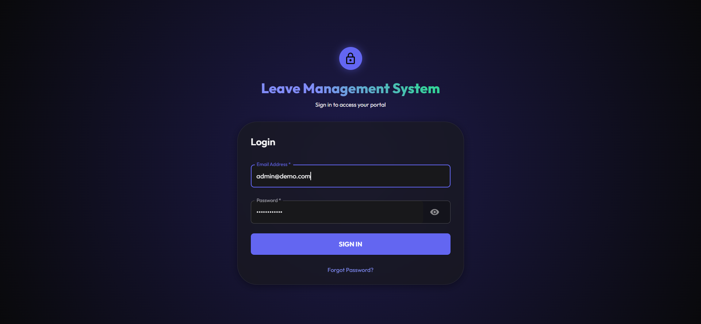
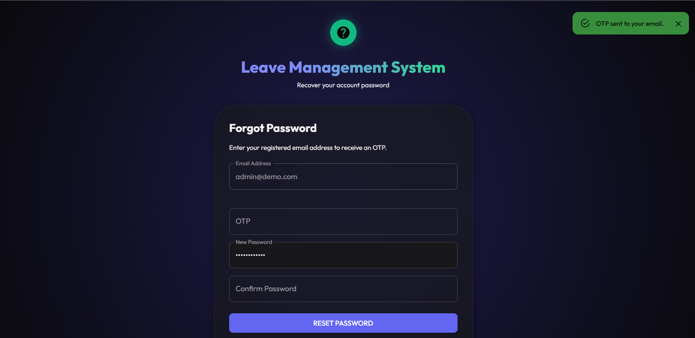
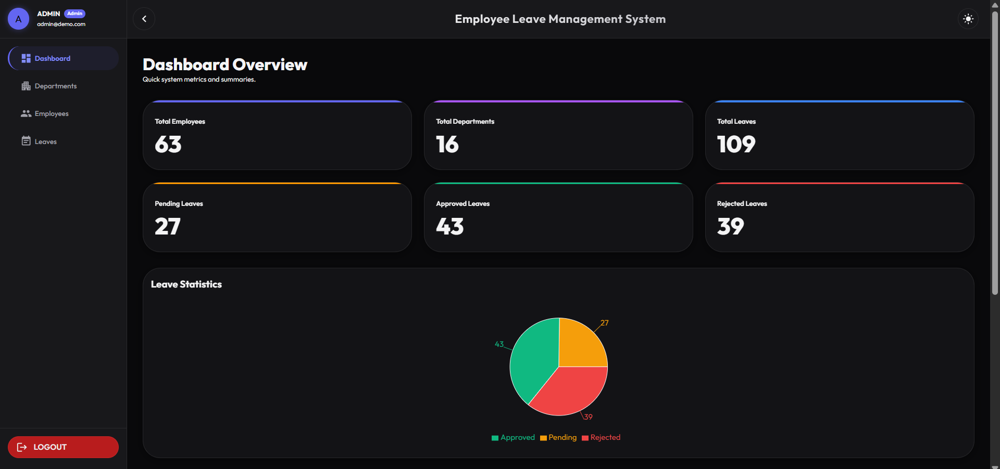
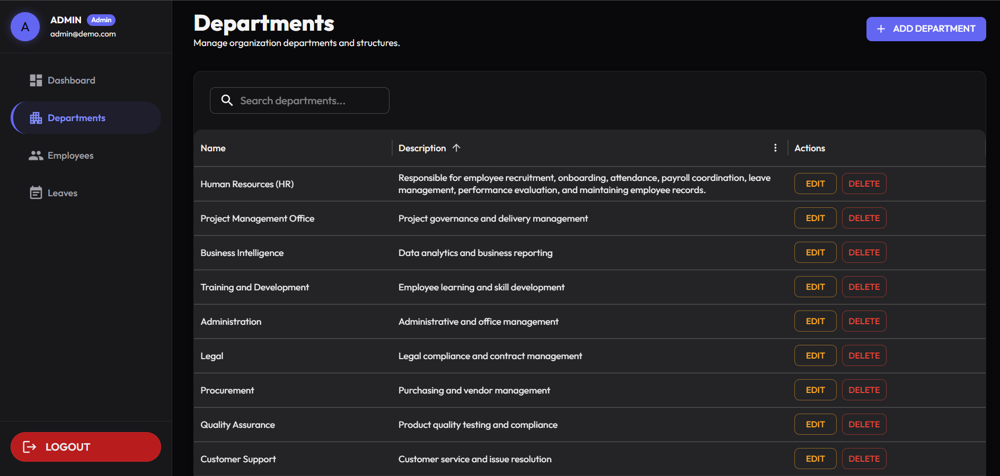
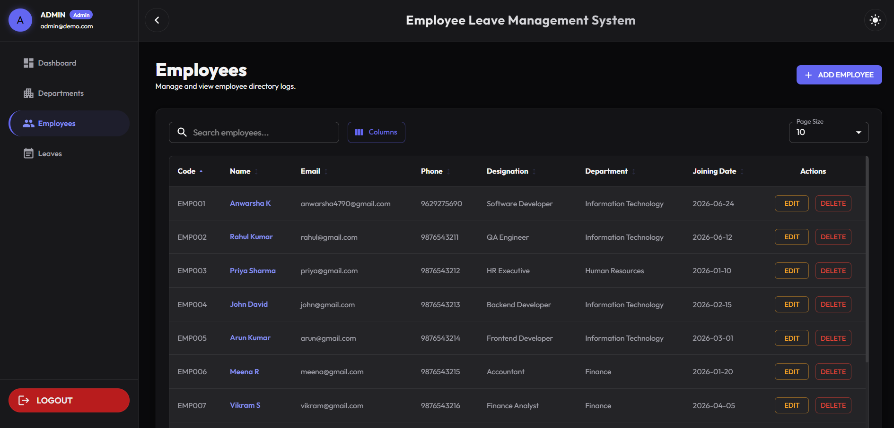
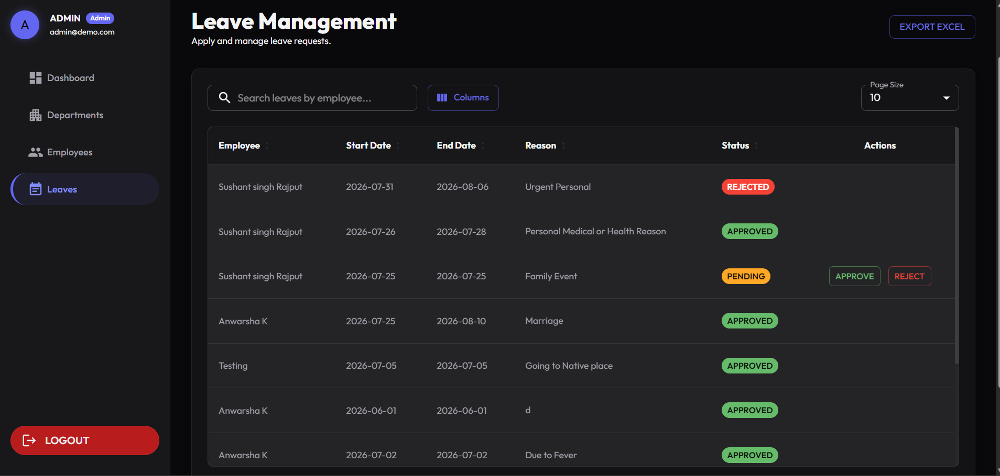
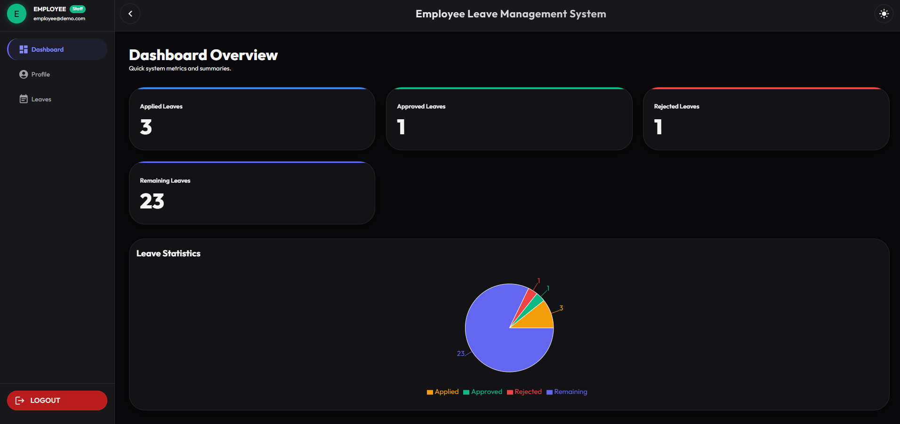
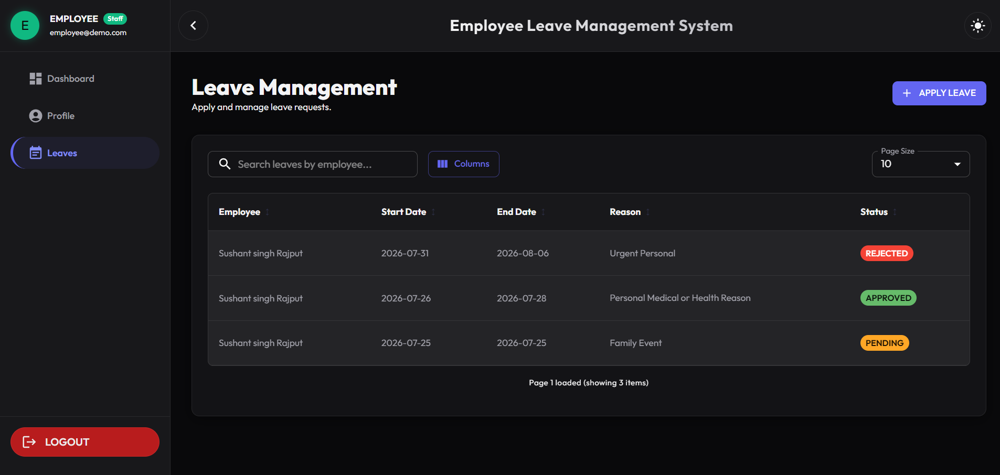
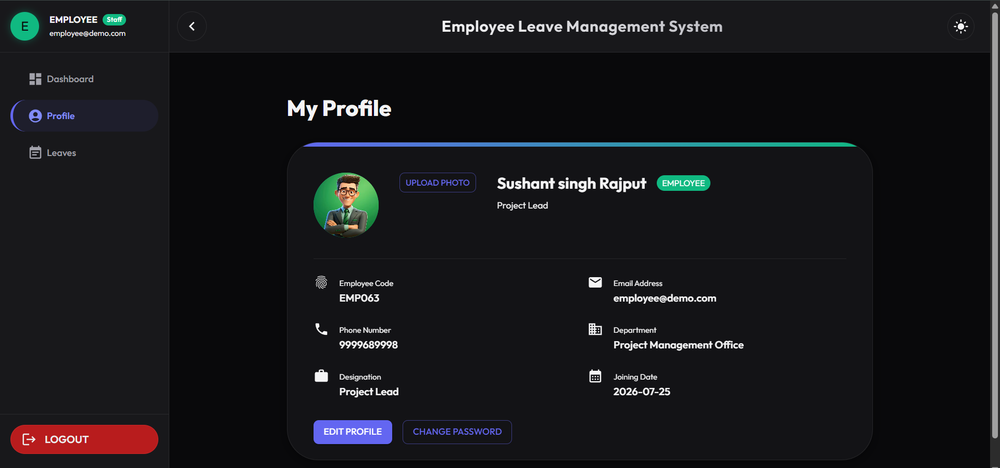

# Employee Leave Management System


A full stack Employee Leave Management System built using **React**, **NestJS**, **PostgreSQL**, and **TypeORM**. The application enables organizations to efficiently manage departments, employees, leave requests, and user authentication with secure role based access control.

---

# Live Demo

**Frontend**

https://employee-leave-management-deploy-tau.vercel.app

---

# Demo Credentials

## Admin

**Email:** admin@demo.com

**Password:** Password@123

### Admin Features

- Dashboard
- Department Management
- Employee Management
- Leave Approval and Rejection
- Profile Management

---

## Employee

**Email:** employee@demo.com

**Password:** Password@123

### Employee Features

- Dashboard
- Apply Leave
- View Leave History
- Update Profile
- Change Password
- Forgot Password using OTP

---

# Features

## Authentication

- JWT Authentication
- Role Based Access Control
- Forgot Password using OTP
- Password Reset
- Change Password
- Secure Password Hashing using bcrypt

## Admin

- Dashboard
- Department CRUD Operations
- Employee CRUD Operations
- Leave Approval and Rejection
- Employee Profile Management

## Employee

- Dashboard
- Apply Leave
- View Leave History
- Update Profile
- Upload Profile Image
- Change Password

---

# Authentication Modes

This project supports two authentication methods.

## JWT Authentication

The deployed demo uses JWT Authentication for a simple login experience.

## Keycloak Single Sign-On

Keycloak authentication is also supported.

Enable it by setting:

```env
USE_KEYCLOAK=true
```

When enabled, users authenticate through Keycloak Single Sign-On.

---

# Tech Stack

## Frontend

- React
- TypeScript
- Material UI
- React Router
- Axios

## Backend

- NestJS
- TypeORM
- JWT
- bcrypt
- Multer
- Resend Email API

## Database

- PostgreSQL
- Neon

## Deployment

- Frontend: Vercel
- Backend: Render
- Database: Neon PostgreSQL

---

# Screenshots

## Login



---

## Forgot Password



---

## Admin Dashboard



---

## Department Management



---

## Employee Management



---

## Admin Leave Management



---

## Employee Dashboard



---

## Employee Leave Management



---

## Profile



---

# Project Structure

```text
Employee-Leave-Management-System
│
├── Backend
│   ├── src
│   ├── uploads
│   └── package.json
│
├── Frontend
│   ├── src
│   ├── public
│   └── package.json
│
├── screenshots
│   ├── Login.png
│   ├── Forgot-Password.png
│   ├── Admin-Dashboard.png
│   ├── Department.png
│   ├── Employees.png
│   ├── Admin-Leave-Management.png
│   ├── Employee-Dashboard.png
│   ├── Employee-Leave-Management.png
│   └── Profile.png
│
└── README.md
```

---

# Installation

## Clone the Repository

```bash
git clone https://github.com/anwarsha479/employee-leave-management-deploy.git

cd employee-leave-management-deploy
```

## Backend Setup

```bash
cd Backend

npm install

npm run start:dev
```

## Frontend Setup

```bash
cd Frontend

npm install

npm run dev
```

---

# Environment Variables

Create a `.env` file inside the **Backend** folder.

```env
PORT=

DB_HOST=
DB_PORT=
DB_USERNAME=
DB_PASSWORD=
DB_NAME=

JWT_SECRET=

RESEND_API_KEY=

USE_KEYCLOAK=false

KEYCLOAK_URL=
KEYCLOAK_REALM=
KEYCLOAK_CLIENT_ID=
KEYCLOAK_CLIENT_SECRET=
```

---

# Future Improvements

- Leave Balance Management
- Attendance Management
- Holiday Calendar
- Dashboard Analytics
- Email Notifications
- File Upload for Leave Documents
- Advanced Search and Filtering

---

# Author

**Anwarsha K**

GitHub

https://github.com/anwarsha479

---

# License

This project is licensed under the MIT License.

---

# Support

If you found this project helpful, please consider giving it a ⭐ on GitHub.